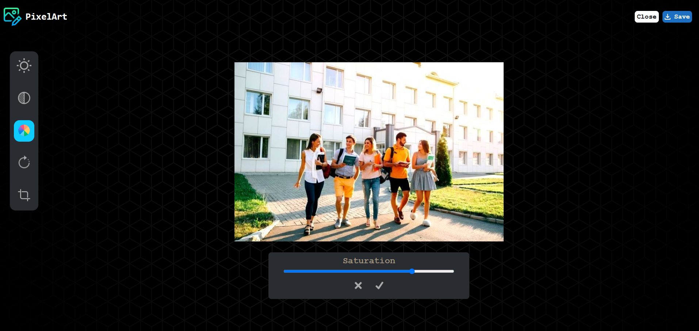

# PixelArt Frontend

PixelArt is an image editing application that allows users to adjust brightness, contrast, saturation, rotation, and crop images. This is the frontend repository of the PixelArt project.

## App Screenshot



## Features

- Adjust image brightness, contrast, and saturation.
- Rotate images in 90-degree increments.
- Crop images to desired dimensions.
- Real-time preview of edits.
- Save the edited image directly to your device using the hosted API.
- Responsive UI for both desktop and mobile.
- The app connects to a hosted backend API for image processing and downloading.

## Technologies Used

- React.js
- TypeScript
- Axios
- React Image Crop
- CSS for styling

## Installation

1. Clone the repository:
    ```bash
        git clone <repository-url>
        cd pixelart-frontend

2. Install dependencies:
    ```bash
        npm install

3. Start the development server:
    ```bash
        npm start

## Usage

1. Open the application in your browser at http://localhost:3000.
2. Upload an image to start editing.
3. Use the tools to adjust brightness, contrast, saturation, rotation, or crop the image.
4. Save or discard changes as needed.

## API Endpoints

The frontend interacts with the backend via the following endpoints:

Base URL: `https://pixelart-backend-t6lh.onrender.com`

- `POST /brightness`: Adjust image brightness.
- `POST /contrast`: Adjust image contrast.
- `POST /saturation`: Adjust image saturation.
- `POST /rotate`: Rotate the image.
- `POST /saveAction`: Save the applied changes.
- `POST /download`: Download the edited image.

**Note:** The API is hosted and accessible online. Ensure you have a stable internet connection to use the app.

